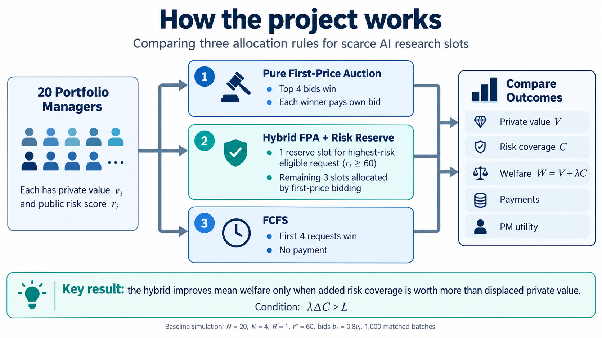

# Auctions with Risk Reserves for Scarce AI Research 
**Qianshuo (Aaron) Wang and Zhenning Wang — COMSCI/ECON 206, Professor Luyao Zhang**
**FP8 · Session D · PS2 computational artifact**



## Research question

Can a hybrid mechanism that combines auction-based allocation with reserved capacity for objectively high-risk research requests improve the allocation of scarce AI research capacity relative to a pure first-price auction?

The project studies an active asset-management setting in which portfolio managers compete for a limited number of premium AI research slots. The main trade-off is between:

- **private research value**, revealed through strategic bidding; and
- **verified downside-risk priority**, represented by a public and bid-independent risk score.

The central condition is:

\[
W(H) > W(P)
\iff
\lambda \Delta C > L
\]

where:

- \(P\) = pure first-price auction,
- \(H\) = hybrid first-price auction with a risk reserve,
- \(\Delta C = C(H)-C(P)\) is the additional risk coverage from the hybrid,
- \(L = V(P)-V(H)\) is the private value displaced by the reserve,
- \(\lambda\) is the firm's welfare weight on risk coverage.

The reserve is therefore justified only when the value of additional risk coverage is large enough to compensate for displaced private research value.

---

## Project setting

In each allocation batch:

- \(N=20\) risk-neutral portfolio managers compete for
- \(K=4\) identical premium AI research slots,
- each PM can receive at most one slot,
- each PM has \(M_i=100\) internal research credits,
- private research value \(v_i \in [0,100]\),
- bid \(b_i \in [0,100]\).

The firm also observes a public current-risk score:

\[
r_i = 100 E_i S_i
\]

where:

- \(E_i \in [0,1]\) is normalized portfolio exposure,
- \(S_i \in [0,1]\) is downside-event severity.

Risk scores are frozen before bidding and are assumed to be bid-independent within the batch.

The normalized PM utility is:

\[
u_i = x_i v_i - p_i
\]

where \(x_i\) indicates whether PM \(i\) receives a slot and \(p_i\) is the payment.

---

## Three allocation mechanisms

### 1. Pure first-price auction

All four slots are allocated through sealed bids.

- The four highest bids win.
- Each winner pays their own bid.
- Under the common baseline bid rule, bid ranking preserves value ranking.

### 2. Hybrid first-price auction + risk reserve

One of the four slots is reserved for a high-risk request.

Baseline policy parameters:

\[
R=1,\qquad r^*=60
\]

Mechanism sequence:

1. Freeze requests, risk scores, and bids.
2. Identify requests with \(r_i \ge 60\).
3. If eligible requests exist, allocate one free reserve slot to the highest-risk eligible PM.
4. Remove that PM from the auction.
5. Allocate the remaining three slots through first-price bidding.
6. If no request is reserve-eligible, return the unused reserve slot to the auction and auction all four slots.

Exact ties are broken by lower PM ID.

### 3. First-Come, First-Served (FCFS)

- Requests receive an exogenous random arrival order.
- The first four requests receive slots.
- No payment is charged.

FCFS is included as a simple non-strategic reference mechanism.

---

## Welfare and evaluation

For an allocation \(A\), define:

\[
V(A)=\sum_{i\in A}v_i
\]

as total private research value,

\[
C(A)=\sum_{i\in A}r_i
\]

as total verified risk coverage, and

\[
W(A)=V(A)+\lambda C(A)
\]

as the firm's modeled welfare index.

Payments are treated as internal transfers and are reported separately rather than subtracted from firm-wide welfare.

The repository reports:

- winner IDs,
- private value \(V\),
- risk coverage \(C\),
- welfare \(W\),
- total payments,
- total PM utility,
- value efficiency,
- eligible-request access,
- matched mechanism differences.

---

## Computational design

The primary synthetic design uses:

| Parameter | Baseline |
|---|---:|
| PMs \(N\) | 20 |
| AI research slots \(K\) | 4 |
| Credit budget \(M\) | 100 |
| Reserve slots \(R\) | 1 |
| Risk threshold \(r^*\) | 60 |
| Welfare weight \(\lambda\) | 1 |
| Private value | \(v_i \sim U[0,100]\) |
| Exposure | \(E_i \sim U[0,1]\) |
| Severity | \(S_i \sim U[0,1]\) |
| Risk score | \(r_i=100E_iS_i\) |
| Baseline bid rule | \(b_i=0.8v_i\) |
| Primary batches | 1,000 |
| Random seed | 20260926 |

The same requests, values, risk scores, and bids are used across mechanisms within each matched batch.

### Important equilibrium boundary

The multi-slot simulation does **not** claim to solve the exact Bayesian Nash equilibrium.

For the computational comparison, we use the explicit stylized monotone bid rule:

\[
b_i=0.8v_i
\]

The exact first-price equilibrium formula

\[
b(v)=\frac{n-1}{n}v
\]

is used only for the separate single-slot theoretical and behavioral benchmark.

For four bidders, this becomes:

\[
b(v)=0.75v
\]

---

## Primary simulation results

The recorded fresh run uses:

- Python 3.9.6,
- seed `20260926`,
- 1,000 independent matched batches.

### Mean outcomes

| Rule | Private value \(V\) | Risk coverage \(C\) | Welfare \(W\) | Payments | PM utility |
|---|---:|---:|---:|---:|---:|
| Pure first-price auction | 353.08 | 101.35 | 454.43 | 282.46 | 70.62 |
| Hybrid | 326.26 | 137.95 | 464.20 | 226.98 | 99.28 |
| FCFS | 199.45 | 100.43 | 299.88 | 0.00 | 199.45 |

### Hybrid vs. pure first-price auction

The hybrid mechanism produces:

\[
\Delta C = +36.59
\]

additional risk-coverage units, while displacing:

\[
L = 26.82
\]

units of private research value.

At:

\[
\lambda=1
\]

the mean welfare difference is:

\[
\Delta W = +9.78
\]

with Monte Carlo standard error:

\[
MCSE = 0.89
\]

At:

\[
\lambda=0.5
\]

the mean welfare difference becomes:

\[
\Delta W=-8.52
\]

The mean break-even welfare weight is approximately:

\[
\lambda^* \approx 0.733
\]

Thus, under the baseline mean outcomes:

- if \(\lambda>0.733\), the hybrid has higher modeled welfare;
- if \(\lambda<0.733\), the pure first-price auction has higher modeled welfare.

Only **43.8% of individual batches** have \(\Delta W>0\) at \(\lambda=1\). Therefore, the positive mean result is **not** universal or state-by-state dominance.

---

## Sensitivity analysis

The repository includes 36 sensitivity scenarios varying:

- risk threshold:

\[
r^* \in \{40,60,80\}
\]

- reserve size:

\[
R \in \{1,2\}
\]

- value-risk alignment,
- bid-rule assumptions,
- welfare weights:

\[
\lambda \in \{0,0.5,1,2\}
\]

The sensitivity analysis shows that the ranking of the mechanisms depends on:

- how private value and risk are aligned,
- how bids are generated,
- how much weight the firm places on risk coverage.

The hybrid mechanism is therefore not presented as universally superior.

---

## Behavioral extension

The computational comparison is complete.

The separate behavioral component remains exploratory and is implemented through a Hugging Face Space.

Four participants compete for one slot in a single-slot first-price auction under either gain or loss framing.

The rational benchmark is:

\[
b(v)=0.75v
\]

Gain and loss treatments use the same numerical payoffs and differ only in framing.

The planned behavioral comparison asks whether observed bidding behavior is sufficiently different from the benchmark to justify revising the bidding assumption or mechanism interpretation.

No simulated bids are treated as human behavioral evidence.

Hugging Face Space:

https://huggingface.co/spaces/Zn7777/PS2_Qianshuo_Zhenning_PM_Bid

---

## Run and verify

The simulation and tests require Python 3.9+ and no third-party packages.

The recorded fresh run used Python 3.9.6.

Run:

```bash
python3 -m unittest -v test_simulation.py
python3 simulation.py --seed 20260926 --batches 1000 --out results
python3 verify_reproduction.py
